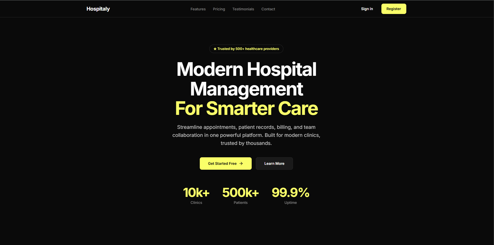
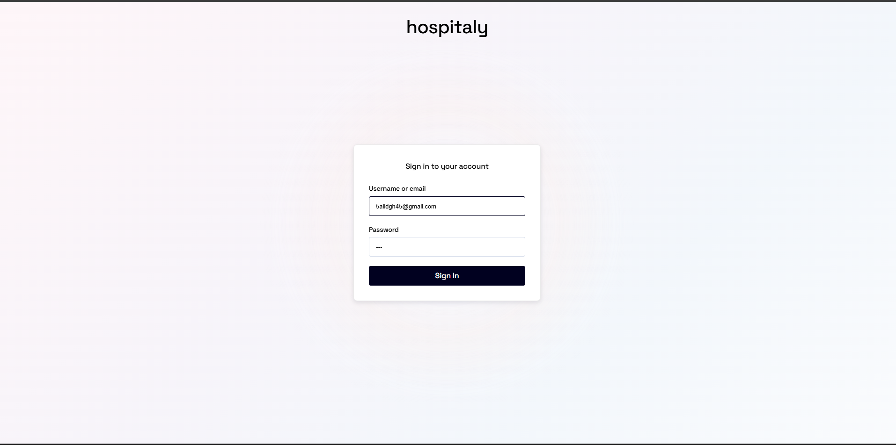
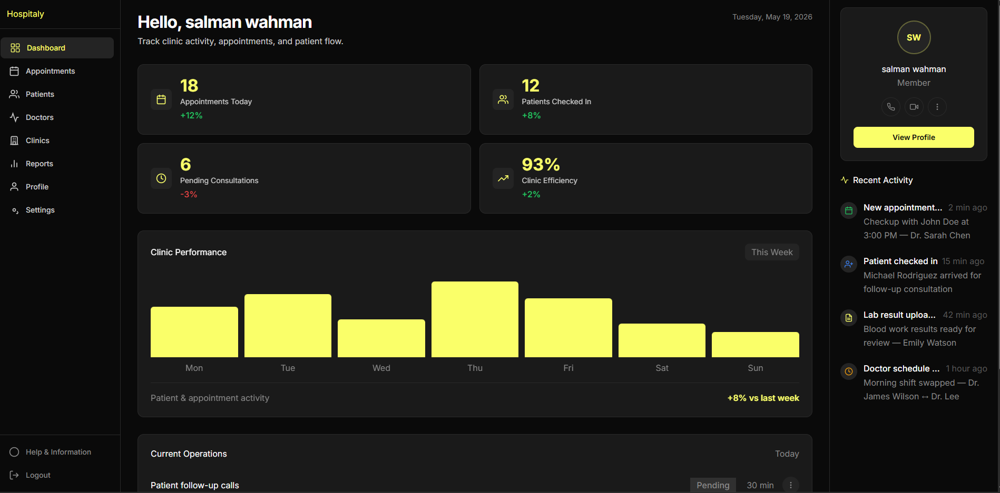
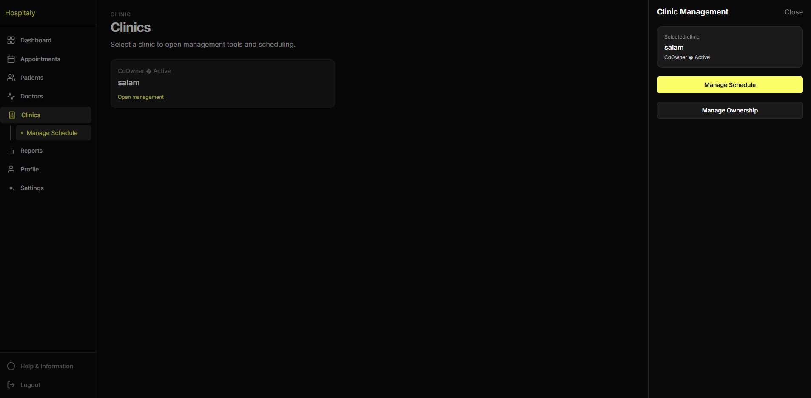
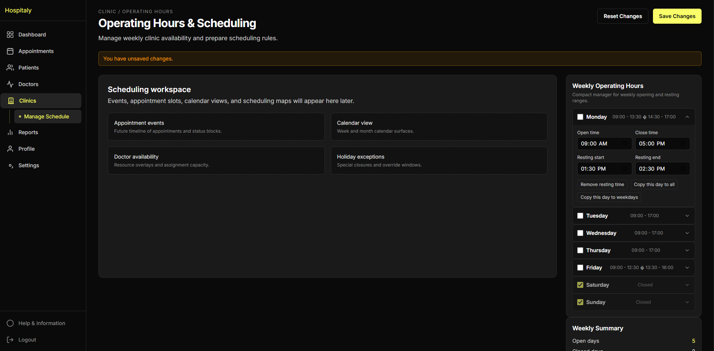
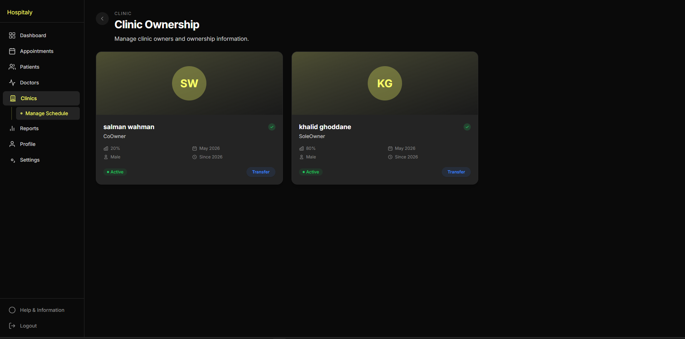
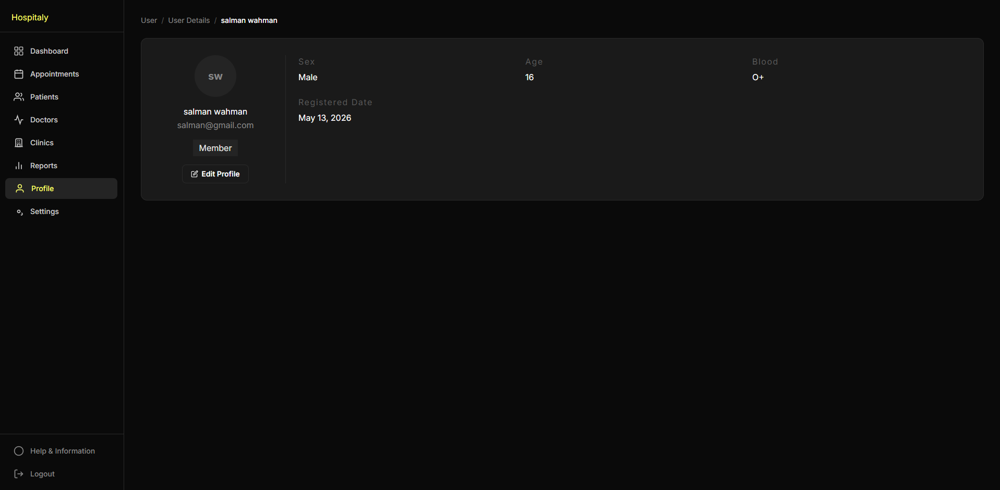

# Hospitaly

> A production-style modular monolith hospital management system built with ASP.NET Core, a BFF security layer, and a modern Angular SPA. The project demonstrates clean architecture, modular boundaries, real-world medical domain use cases, and production-inspired application design.

[](https://dotnet.microsoft.com/)
[](https://angular.dev/)
[](https://www.postgresql.org/)
[](https://www.keycloak.org/)
[](https://www.docker.com/)

---

## Table of Contents

- [Overview](#overview)
- [Architecture](#architecture)
- [Project Structure](#project-structure)
- [Modular Monolith](#modular-monolith)
- [Implemented Use Cases](#implemented-use-cases)
- [BFF Layer](#bff-layer)
- [Frontend SPA](#frontend-spa)
- [Technologies Used](#technologies-used)
- [Local Development Setup](#local-development-setup)
- [Configuration](#configuration)
- [Database](#database)
- [Authentication and Authorization](#authentication-and-authorization)
- [Design Patterns and Practices Demonstrated](#design-patterns-and-practices-demonstrated)
- [Screenshots](#screenshots)
- [Roadmap](#roadmap)
- [Why This Project Matters](#why-this-project-matters)

---

## Overview

Hospitaly is a **modular monolith** application for managing medical facilities. It covers clinic administration, doctor credentialing, scheduling, patient appointments, and user management — all within a single deployable backend that is logically separated into feature modules.

This is a **portfolio / CV project** designed to demonstrate:

- **Modular monolith architecture** with clear module boundaries
- **Clean Architecture** (Domain → Application → Infrastructure → Presentation) per module
- **CQRS** command/query separation via MediatR
- **BFF security pattern** (Backend for Frontend) with YARP reverse proxy
- **Domain-driven design** with rich domain models and value objects
- **OpenID Connect authentication** via Keycloak
- **Full-stack integration** between an Angular SPA and a .NET backend

---

## Architecture

```
┌──────────────────────────────────────────────────────────────────┐
│                        Browser (SPA)                             │
│                   https://localhost:4200                          │
└──────────────────────────┬───────────────────────────────────────┘
                           │
                           ▼
┌──────────────────────────────────────────────────────────────────┐
│                   BFF — Hospitaly.Bff                             │
│         YARP Reverse Proxy + OIDC Auth + Session Mgmt            │
│                  https://localhost:7214                            │
│                                                                   │
│  ┌────────────┐  ┌──────────────┐  ┌──────────────────────────┐  │
│  │ Auth       │  │ Session      │  │ YARP Proxy                │  │
│  │ (OIDC)     │  │ (Redis)      │  │ /api/** → backend         │  │
│  └────────────┘  └──────────────┘  └──────────┬───────────────┘  │
└──────────────────────────────────────────────────┼────────────────┘
                                                   │
                                                   ▼
┌──────────────────────────────────────────────────────────────────┐
│              API — Hospitaly.Api                                 │
│               http://localhost:5500                               │
│                                                                   │
│  ┌──────────────┐  ┌──────────────┐  ┌────────────────────────┐  │
│  │ Users Module │  │ Cliniks      │  │ Common Libraries        │  │
│  │ (auth/prof.) │  │ Module       │  │ (Domain, App, Infra,   │  │
│  │              │  │ (clinics,    │  │  Presentation)          │  │
│  │              │  │  doctors,    │  │                         │  │
│  │              │  │  appts)      │  │                         │  │
│  └──────┬───────┘  └──────┬───────┘  └────────────────────────┘  │
└─────────┼──────────────────┼──────────────────────────────────────┘
          │                  │
          ▼                  ▼
┌──────────────────────────────────────────────────────────────────┐
│                      PostgreSQL                                    │
│              Schemas: users, clinics                               │
│              EF Core (commands) + Dapper (queries)                 │
└──────────────────────────────────────────────────────────────────┘

┌─────────────────────────┐  ┌──────────────────────────────┐
│      Redis              │  │      Keycloak                │
│  Session storage        │  │  OIDC Provider               │
│  User data cache        │  │  User management             │
└─────────────────────────┘  └──────────────────────────────┘
```

### Request Flow

```
User action in SPA
  → HTTP request to BFF (https://localhost:7214/api/...)
  → YARP reverse proxy matches route
  → BFF extracts session_id from cookie
  → BFF loads session from Redis
  → BFF refreshes access token if within 30s of expiry
  → BFF attaches Bearer token to upstream request
  → Backend API validates JWT
  → API loads user permissions from the database
  → API controller dispatches MediatR command/query
  → Application layer runs validation + business logic
  → Domain layer enforces invariants
  → Infrastructure persists or reads data
  → Response returns through the chain to SPA
```

> 
>
> *Replace this placeholder with a real request flow diagram.*

---

## Project Structure

```
Hospitaly/
├── .agents/                          # AI agent skills and configurations
├── .container/                       # Docker container data (volumes)
├── .containers/identity/             # Keycloak identity data
├── docs/
│   ├── diagrams/                     # Excalidraw entity and VO diagrams
│   └── images/                       # README image placeholders
├── src/
│   ├── Api/
│   │   ├── Hospitaly.Api/            # ASP.NET Core API host
│   │   └── Hospitaly.Bff/            # YARP reverse proxy + OIDC auth + session management
│   ├── Common/
│   │   ├── Hospitaly.Common.Domain/       # Base entity, aggregate root, domain events, audit
│   │   ├── Hospitaly.Common.Application/  # CQRS abstractions, validation, pagination
│   │   ├── Hospitaly.Common.Infrastructure/ # JWT auth, EF Core, Dapper, DB seeding
│   │   └── Hospitaly.Common.Presentation/  # ApiResponse envelope, exception middleware, route prefix
│   └── Modules/
│       ├── Cliniks/
│       │   ├── Hospitaly.Modules.Clinic.Domain/        # Clinic / doctor / appointment aggregates
│       │   ├── Hospitaly.Modules.Clinic.Application/   # 36+ commands and queries
│       │   ├── Hospitaly.Modules.Clinic.Infrastructure/ # EF Core DbContext, migrations, repos
│       │   ├── Hospitaly.Modules.Clinic.Presentation/  # Clinic, Doctor, Specialty controllers
│       │   └── tests/
│       │       ├── ArchitectureTests/                  # NetArchTest rules enforcement
│       │       └── Domain/                             # Domain unit tests
│       └── Users/
│           ├── Hospitaly.Modules.Users.Domain/         # User entity, value objects, roles
│           ├── Hospitaly.Modules.Users.Application/    # Registration, onboarding, queries
│           ├── Hospitaly.Modules.Users.Infrastructure/ # Keycloak integration, permissions, repos
│           ├── Hospitaly.Modules.Users.Presentation/   # User controller, permissions constants
│           └── PublicApi/                              # Cross-module integration interface
├── tests/
│   ├── ArchitectureTests/              # Root-level architecture tests (scaffolded)
│   ├── BusinessTests/                  # Business scenario tests (scaffolded)
│   └── DomainScenarios/                # Domain scenario runner (console app)
├── themes/
│   └── hospitaly/                      # Custom Keycloak theme
├── docker-compose.yml                  # 6 Docker services
├── docker-compose.override.yml         # Development overrides
├── Hospitaly.slnx                      # Solution file (.slnx format)
└── AGENTS.md                           # AI agent guide for this project
```

### Shared Libraries

| Project | Purpose |
|---|---|
| `Common.Domain` | Base `Entity` and `AggregateRoot` classes, `DomainEvent`, `AuditInfo`, common value objects |
| `Common.Application` | `ICommand` / `IQuery` / `ICommandHandler` / `IQueryHandler` interfaces, `FluentValidation`, `PaginatedResult`, `IDbConnectionFactory` |
| `Common.Infrastructure` | JWT Bearer + dynamic permission authorization, `DbConnectionFactory` (Npgsql), `DatabaseSeeder` |
| `Common.Presentation` | `ApiResponse<T>` envelope, `ExceptionHandlingMiddleware`, `GlobalRoutePrefixConvention` |

---

## Modular Monolith

The backend is organized into **two feature modules**, each following Clean Architecture with four layers. Modules communicate through a `PublicApi` interface rather than direct project dependencies.

| Module | Responsibility | Example Use Cases |
|---|---|---|
| **Cliniks** | Clinic and medical provider management | Create clinic, manage operating hours, doctor credentialing, specialty management, ownership tracking |
| **Users** | User identity and profile management | Register user, complete onboarding, assign roles, search users, permission management |

### Module Isolation

- Each module has its own **DbContext** with a dedicated database schema (`users`, `clinics`)
- **Domain projects** contain entities, value objects, and repository interfaces — no external dependencies
- **Application projects** define commands, queries, handlers, and validation — depend only on Domain
- **Infrastructure projects** implement repositories and DbContexts — depend on Application
- **Presentation projects** expose HTTP endpoints via ASP.NET Core controllers
- Cross-module communication uses the `PublicApi` project (e.g., `IUserApi` interface consumed by Cliniks)

### Domain Model (Cliniks)

The Cliniks module contains a rich domain model with multiple aggregates:

```
Clinic ──┬── ClinicInfo (VO)
         ├── ClinicAddress (VO)
         ├── ClinicContactInfo (VO)
         ├── OperatingLicense (entity)
         ├── Department (entity)
         ├── ClinicOwnership (entity)
         ├── ClinicSpecialty (entity)
         ├── OperatingHours (VO collection)
         └── Doctor ──┬── DoctorCredential (entity)
                      ├── DoctorSpecialty (entity)
                      └── ClinicAffiliation (entity)

Appointment ──┬── Patient
              ├── Room
              └── DoctorSchedule ──┬── ScheduleBlock (entity)
                                   └── MaintenanceBlock (entity)

StaffMember
Specialty
```

---

## Implemented Use Cases

### UI-Exposed Use Cases

These features are fully wired from the Angular SPA through to the backend:

| Feature | SPA Page | Backend Handler |
|---|---|---|
| User registration | `/register` | `RegisterUserCommand` |
| User login (OIDC flow) | Login button → `/bff/auth/login` | BFF OIDC challenge |
| View profile | `/dashboard/profile` | `GetCurrentUserDataQuery` |
| Complete onboarding wizard | `/onboarding` | `CompleteOnboardingCommand` |
| List my clinics | `/dashboard/clinics` | `GetMyClinicsQuery` |
| View clinic ownerships | `/dashboard/clinics/:id/ownership` | `GetClinicOwnershipsQuery` |
| Transfer clinic ownership | Ownership page | `TransferClinicOwnershipToUserCommand` |
| View / set operating hours | `/dashboard/clinics/:id/schedule` | `GetClinicOperatingHoursQuery`, `SetClinicOperatingHoursCommand` |
| Search users (for ownership transfer) | Ownership page | `SearchUsersByEmailQuery` |

### Backend-Only Use Cases

These use cases exist in the backend Application layer but are **not exposed in the SPA UI**. They demonstrate the full application architecture — commands, validation, domain logic, and persistence — even without a frontend connection.

| Module | Use Cases |
|---|---|
| **Cliniks** | Create clinic, update clinic info/address/contact, add/remove clinic specialty, add/update/remove department, replace operating license, update license status, apply/expire/terminate/transfer ownership, create doctor, activate/deactivate doctor, update doctor profile / upload avatar, manage credentials (add/verify/revoke/suspend/reactivate), manage doctor specialties, affiliate doctor with clinic, manage affiliation status, query doctors by various criteria, search clinics |
| **Users** | Assign role, get user permissions, get user info |

> Some use cases are implemented only in the backend to demonstrate application architecture, domain logic, and data persistence patterns, even if they are not currently connected to the UI. This includes the full doctor management lifecycle (credentialing, affiliation, status transitions) and advanced clinic ownership operations.

---

## BFF Layer

The `Hospitaly.Bff` project implements the **Backend for Frontend** pattern using YARP reverse proxy. It is the single entry point for the Angular SPA.

### Responsibilities

- **Authentication**: Initiates OIDC login flow with Keycloak, handles the callback, manages the session cookie
- **Session Management**: Stores access/refresh tokens in Redis (7-day TTL), lists active sessions, supports session revocation
- **Token Lifecycle**: Automatically refreshes access tokens when within 30 seconds of expiry before proxying requests
- **Request Proxying**: YARP forwards all `/api/**` requests to the backend API, attaching the Bearer token
- **User Data**: Provides a `/bff/user/me` endpoint that aggregates user profile, roles, and permissions (with Redis caching, 15-min TTL)
- **Onboarding**: Exposes `/bff/user/onboarding/complete` to mark first-time setup as done

### Endpoints

```
GET    /bff/auth/login              → OIDC challenge → Keycloak
GET    /bff/auth/check_session      → Validate session cookie
GET    /bff/auth/logout             → Revoke sessions, clear cookie
GET    /bff/user/me                 → User profile + roles + permissions
POST   /bff/user/register           → Create new user
POST   /bff/user/onboarding/complete → Mark onboarding done
GET    /bff/sessions                → List active sessions
DELETE /bff/sessions/{sessionId}    → Revoke specific session
DELETE /bff/sessions                → Revoke all sessions
api/{**catch-all}                   → YARP proxy to backend
```

> 
>
> *Replace this placeholder with a real BFF flow diagram.*

---

## Frontend SPA

The client application is built with **Angular 21** using standalone components (no NgModules), styled with **Tailwind CSS v4**, and animated with **AnimeJS v4**.

### Pages / Routes

| Path | Page | Description |
|---|---|---|
| `/` | Landing page | Marketing landing with hero, features, pricing, FAQ, testimonials |
| `/register` | Registration | User registration form |
| `/onboarding` | Onboarding wizard | First-time setup (role selection) |
| `/dashboard` | Dashboard shell | Main app layout with sidebar navigation |
| `/dashboard` | Dashboard home | Metrics, activity feed, tasks, performance chart |
| `/dashboard/profile` | Profile | View user profile details |
| `/dashboard/clinics` | Clinics list | List of user's clinics |
| `/dashboard/clinics/:id/schedule` | Operating hours | Visual weekly schedule editor |
| `/dashboard/clinics/:id/ownership` | Ownership management | View / transfer clinic ownership shares |

### Key Services

| Service | HTTP Calls | Purpose |
|---|---|---|
| `AuthService` | `GET /bff/auth/check_session`, `GET /bff/user/me` | Authentication state (Angular signals) |
| `ClinicsService` | `GET /bff/api/clinics/my` | Fetch user's clinics |
| `ClinicOperatingHours` | `GET`, `PUT /bff/api/clinics/{id}/operating-hours` | Weekly schedule CRUD |
| `ClinicOwnershipsService` | `GET`, `POST /bff/api/clinics/{id}/ownerships` | Ownership management |
| `UserDataService` | `GET /bff/user/me` | User profile data |

### Architecture Decisions

- All HTTP requests use `{ withCredentials: true }` (via `credentialsInterceptor`) to send the session cookie automatically
- The `authGuard` protects authenticated routes and triggers session validation on navigation
- Angular calls **only the BFF** — never the API directly
- API responses are unwrapped from `ApiResponse<T>` in services before reaching components
- User authentication state is managed via Angular signals for reactive UI updates

---

## Technologies Used

| Area | Technology |
|---|---|
| **Runtime** | .NET 10 (ASP.NET Core) |
| **Frontend Framework** | Angular 21 (standalone components) |
| **Architecture** | Modular Monolith, Clean Architecture (4 layers per module) |
| **CQRS** | MediatR 14 |
| **Database** | PostgreSQL 17 |
| **ORM (Commands)** | Entity Framework Core 10 |
| **Querying (Reads)** | Dapper 2 |
| **Authentication** | Keycloak (OpenID Connect) — Authorization Code + PKCE |
| **Authorization** | Permission-based dynamic policies |
| **Session / Cache** | Redis (StackExchange.Redis) |
| **Reverse Proxy / BFF** | YARP 2 |
| **Validation** | FluentValidation 12 |
| **Result Pattern** | ErrorOr |
| **API Documentation** | Scalar (Swagger alternative) |
| **Containerization** | Docker / Docker Compose (6 services) |
| **CSS Framework** | Tailwind CSS v4 |
| **Animations** | AnimeJS v4 |
| **Unit Testing** | xUnit, NUnit, Vitest |
| **Architecture Testing** | NetArchTest.Rules + FluentAssertions |

---

## Local Development Setup

### Prerequisites

- [.NET 10 SDK](https://dotnet.microsoft.com/download/dotnet/10.0)
- [Node.js 22+](https://nodejs.org/)
- [Docker Desktop](https://www.docker.com/products/docker-desktop/)
- [Angular CLI](https://angular.dev/cli) (`npm install -g @angular/cli`)

### 1. Start Infrastructure Services

```bash
docker compose up -d
```

This starts 6 services: PostgreSQL, Keycloak, Redis, RedisInsight, and the two .NET application containers (API + BFF).

### 2. Build and Run the Backend

```bash
dotnet restore Hospitaly.slnx
dotnet build Hospitaly.slnx

# Run the API with seed data (populates medical specialties)
dotnet run --project src/Api/Hospitaly.Api -- --seed
```

Migrations are auto-applied in `Development` mode. The `--seed` argument triggers the `DatabaseSeeder`.

### 3. Run the Frontend

```bash
cd src/Api/Hospitaly.Bff/Hospitaly.Client
npm install
ng serve
```

The SPA runs at `https://localhost:4200`.

### 4. Access the Application

| Service | URL |
|---|---|
| SPA | https://localhost:4200 |
| BFF | https://localhost:7214 |
| API | http://localhost:5500 |
| API Docs (Scalar) | http://localhost:5500/scalar/v1 |
| Keycloak Admin | http://localhost:28080/admin (admin / admin) |
| RedisInsight | http://localhost:5540 |

> Adjust the project paths based on your local setup. Docker Compose profiles in `launchSettings.json` can also be launched from Visual Studio or Rider.

---

## Configuration

### Important Configuration Files

| File | Purpose |
|---|---|
| `docker-compose.yml` | 6 services, networks, volumes, ports |
| `docker-compose.override.yml` | Development-specific overrides |
| `src/Api/Hospitaly.Api/appsettings.Development.json` | DB connection string, JWT issuers, Keycloak metadata address |
| `src/Api/Hospitaly.Api/appSettings/users/modules.users.Development.json` | Keycloak Admin API credentials |
| `src/Api/Hospitaly.Bff/appsettings.Development.json` | OIDC client credentials, CORS origins, Redis connection |
| `src/Api/Hospitaly.Bff/appsettings.json` | YARP route / cluster configuration, OIDC scheme defaults |
| `Hospitaly.Client/angular.json` | Build / serve / test config, SSL, Tailwind, Vitest |

> **⚠️ Security Warning**: Never commit real secrets, passwords, tokens, or production connection strings to GitHub. The configuration files in this repository contain development-only credentials for local Docker services.

---

## Database

### Engine

PostgreSQL 17 running in Docker (`hospitaly.database:5432` internally, `localhost:5433` externally).

### Approach

- **Commands / Writes**: Entity Framework Core with module-specific DbContexts
- **Queries / Reads**: Dapper via `IDbConnectionFactory` for lightweight, optimized queries

### Schemas

| Schema | DbContext | Contents |
|---|---|---|
| `users` | `UserDbContext` | User accounts, profiles, onboarding status |
| `clinics` | `ClinikDbContext` | Clinics, doctors, appointments, patients, rooms, schedules, specialties |

### Migrations

- Auto-applied in `Development` via `ApplyMigrations()` at startup
- Users module: multiple EF Core migrations in `Users.Infrastructure/Database/Migrations/`
- Cliniks module: initial baseline migration

### Seed Data

- `DatabaseSeeder` orchestrates all `ISeeder` implementations
- `SpecialtySeeder` — seeds medical specialties (required for the system to function)
- Run with `--seed` CLI argument

---

## Authentication and Authorization

### Authentication (BFF + Keycloak OIDC)

This project uses the **Backend for Frontend (BFF) security pattern** — the Angular SPA never handles tokens directly:

1. User clicks "Login" → redirected to `/bff/auth/login`
2. BFF initiates OIDC Authorization Code + PKCE flow with Keycloak
3. User authenticates in Keycloak
4. Keycloak redirects to `/signin-oidc` with an authorization code
5. BFF exchanges the code for tokens, creates a **session** in Redis (key: `session:{sessionId}`, 7-day TTL), and sets an **HttpOnly session cookie**
6. All subsequent requests include the session cookie automatically
7. Before proxying to the API, YARP loads the session from Redis and attaches the Bearer token
8. Access tokens are auto-refreshed when within 30 seconds of expiry

### Authorization (API)

The backend enforces authorization via:

- `[Authorize]` — requires any authenticated user
- `[Authorize("permission:name")]` — dynamic permission-based policies
- Roles: `Member`, `Administrator`, `Doctor`, `Nurse`, `Pharmacist`, `HospitalAdministrator`, `Patient`
- Permissions loaded from the database on each request via `CustomClaimsTransformation`
- `HttpContext.User.GetUserId()` / `GetIdentityId()` / `GetPermissions()` extension methods

### Redis Key Structure

| Key Pattern | Value | TTL |
|---|---|---|
| `session:{sessionId}` | UserSession (access token, refresh token, metadata) | 7 days |
| `user_sessions:{userId}` | Set of session IDs | None |
| `client_user_data:{userId}` | Cached user profile (from `/me`) | 15 minutes |

### Keycloak Clients

| Client | Grant Type | Purpose |
|---|---|---|
| `hospitaly-bff-client` | Authorization Code + PKCE | BFF OIDC login flow |
| `hospitaly-confidential-api` | Client Credentials | Keycloak Admin REST API (user registration) |

---

## Design Patterns and Practices Demonstrated

This project demonstrates:

- **Modular Monolith Architecture** — Logical module separation without distributed system complexity; modules communicate through explicit public API interfaces
- **Clean Architecture (4 layers per module)** — Strict dependency inversion: Domain → Application → Infrastructure → Presentation; inner layers have no knowledge of outer layers
- **CQRS** — Command / Query separation via MediatR; every use case is a distinct request class and handler
- **Domain-Driven Design** — Rich domain models with encapsulated behavior, value objects for domain primitives (`Email`, `PhoneNumber`, `BloodType`, `Address`), domain events
- **BFF Security Pattern** — SPA never sees tokens; all authentication handled server-side with HttpOnly cookies; tokens stored in Redis with automatic refresh
- **Repository Pattern** — Repository interfaces in Domain, implementations in Infrastructure
- **Result Pattern** — `ErrorOr<T>` for explicit success/failure handling instead of exceptions for business logic flows
- **Standardized API Responses** — `ApiResponse<T>` envelope wrapping all API responses with consistent error format
- **Centralized Validation** — FluentValidation validators per command, executed by MediatR pipeline behavior
- **Dual Database Approach** — EF Core for commands / writes (full ORM with change tracking), Dapper for reads (lightweight, optimized queries)
- **Database per Module** — Each module has its own DbContext and schema, enabling independent migration and evolution
- **Cross-Module Integration** — Public API interfaces for controlled cross-module communication without direct project references
- **Permission-Based Authorization** — Dynamic policies loaded from the database, not just role-based
- **Docker-Based Local Infrastructure** — Full dependency stack (PostgreSQL, Redis, Keycloak) in Docker Compose
- **Architecture Enforcement** — Automated tests using NetArchTest.Rules to enforce conventions (sealed commands, private constructors, naming rules)
- **Separation of UI and Backend Capabilities** — Many use cases exist in the Application layer without UI exposure, demonstrating architecture designed independently of the frontend

---

## Screenshots

| Page | Preview                                        |
|---|------------------------------------------------|
| Landing Page |    |
| Login (Keycloak) |                 |
| Dashboard |         |
| Clinic Management |   |
| Operating Hours Editor |  |
| Ownership Management |         |
| User Profile |             |

> Replace these placeholders with actual screenshots from the running application.

---

## Roadmap

- **Connect remaining backend use cases to the SPA** — Wire up doctor management, appointment scheduling, clinic creation, and other backend-only features to the frontend
- **Add more automated tests** — Expand unit tests, integration tests, and end-to-end tests with Playwright
- **Add CI/CD pipeline** — GitHub Actions workflow for build, test, lint, and deploy
- **Add production deployment configuration** — Production-ready Dockerfile optimization, health checks, environment variable management
- **Improve observability** — Add structured logging, metrics, and distributed tracing
- **Complete appointment scheduling** — The Appointment, Patient, Room, and DoctorSchedule aggregates exist in the domain but need full use case plumbing
- **Add real architecture diagrams** — Replace placeholder images with proper architecture, request-flow, and BFF diagrams
- **Add API versioning** — Introduce versioning strategy for long-term evolution
- **Improve documentation** — Add API reference docs, developer onboarding guide, and deployment guide

---

## Why This Project Matters

This project is **not just another CRUD application**. It was built with the deliberate goal of demonstrating real-world backend architecture skills that matter in production environments:

- **Real architecture, not scaffolding** — Every module follows Clean Architecture with strict layer separation. Domain logic lives in domain models, not services. Infrastructure details are hidden behind interfaces. Use cases are explicit command/query classes.

- **Modular boundaries that mean something** — Modules are not just folders. They have their own database schemas, their own dependency graphs, and explicit cross-module communication contracts. The architecture supports extracting a module into a separate microservice if needed.

- **Production-inspired request flow** — The BFF pattern, OIDC authentication, Redis session management, permission-based authorization, auto-refresh of tokens, and standard API envelopes mirror patterns used in real .NET applications handling sensitive medical data.

- **Security-first SPA integration** — The Angular SPA never touches access tokens. The BFF pattern means the frontend is just another client — all secrets, tokens, and authentication logic live server-side.

- **Scalable by design** — Adding a new module follows the same well-defined pattern: Domain → Application → Infrastructure → Presentation. The common libraries provide reusable building blocks (CQRS, validation, API responses, DB connections) that every module uses.

- **Practical use of the modern .NET ecosystem** — .NET 10, EF Core 10, Dapper, MediatR, FluentValidation, YARP, OpenID Connect, Docker, and PostgreSQL — all working together in a cohesive system.

---

*This project is created for portfolio and demonstration purposes.*
